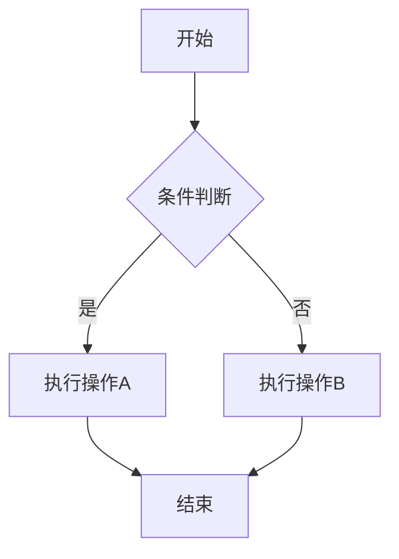
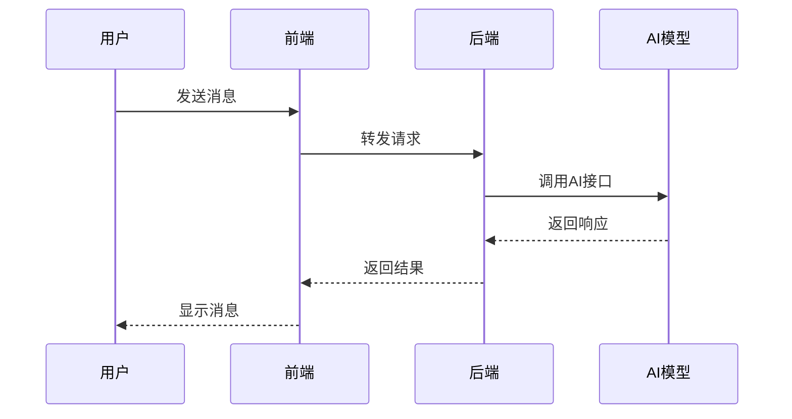
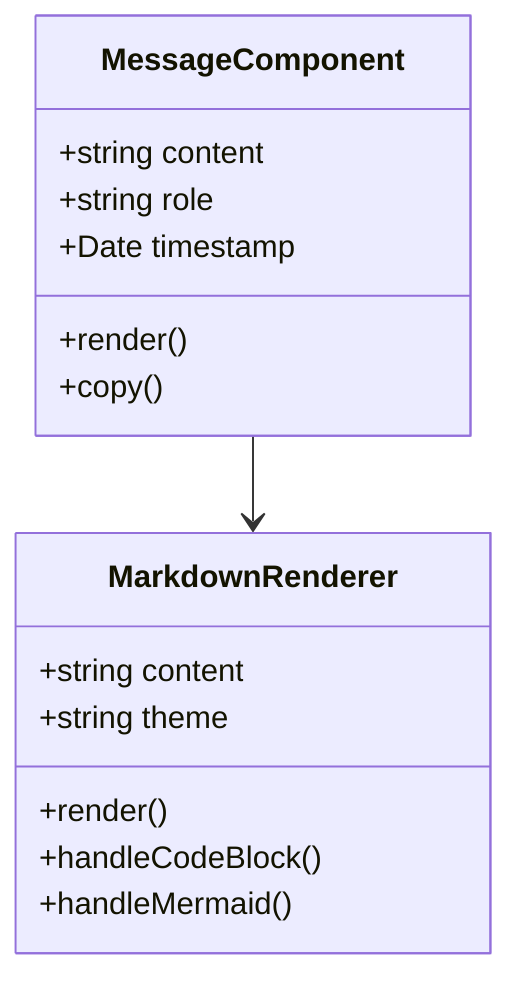

# Markdown 渲染测试

这是一个测试文档，用于验证我们的 Markdown 渲染功能是否正常工作。

## 代码块测试

### JavaScript 代码

```javascript
function greet(name) {
  console.log(`Hello, ${name}!`);
  return `Welcome, ${name}`;
}

const user = "World";
greet(user);
```

### Python 代码

```python
def fibonacci(n):
    if n <= 1:
        return n
    return fibonacci(n-1) + fibonacci(n-2)

# 计算前10个斐波那契数
for i in range(10):
    print(f"F({i}) = {fibonacci(i)}")
```

### 行内代码

这里有一些 `行内代码` 示例，比如 `console.log()` 和 `print()` 函数。

## 表格测试

| 功能 | 状态 | 说明 |
|------|------|------|
| Markdown 渲染 | ✅ 完成 | 支持标准 Markdown 语法 |
| 语法高亮 | ✅ 完成 | 使用 react-syntax-highlighter |
| 表格支持 | ✅ 完成 | 通过 remark-gfm 插件 |
| Mermaid 图表 | ✅ 完成 | 支持各种图表类型 |

## Mermaid 图表测试

### 流程图



### 时序图



### 类图



## 其他 Markdown 元素

### 列表

- 无序列表项 1
- 无序列表项 2
  - 嵌套项 2.1
  - 嵌套项 2.2
- 无序列表项 3

1. 有序列表项 1
2. 有序列表项 2
3. 有序列表项 3

### 引用

> 这是一个引用块。
>
> 引用可以包含多个段落，也可以包含其他 Markdown 元素。

### 链接

这是一个 [链接到 GitHub](https://github.com) 的示例。

### 强调

这是 **粗体文本** 和 *斜体文本* 的示例。

### 分割线

---

### 复杂的 Mermaid 图表

```mermaid
gitgraph
    commit id: "初始提交"
    branch develop
    checkout develop
    commit id: "添加功能A"
    commit id: "添加功能B"
    checkout main
    merge develop
    commit id: "发布 v1.0"
    branch feature/markdown
    checkout feature/markdown
    commit id: "实现 Markdown 渲染"
    commit id: "添加语法高亮"
    commit id: "添加 Mermaid 支持"
    checkout main
    merge feature/markdown
    commit id: "发布 v1.1"
```

## 测试总结

如果您能看到：

- ✅ 代码块有语法高亮
- ✅ 表格格式正确
- ✅ Mermaid 图表正确渲染
- ✅ 其他 Markdown 元素显示正常

那么我们的 Markdown 渲染功能就已经成功实现了！
