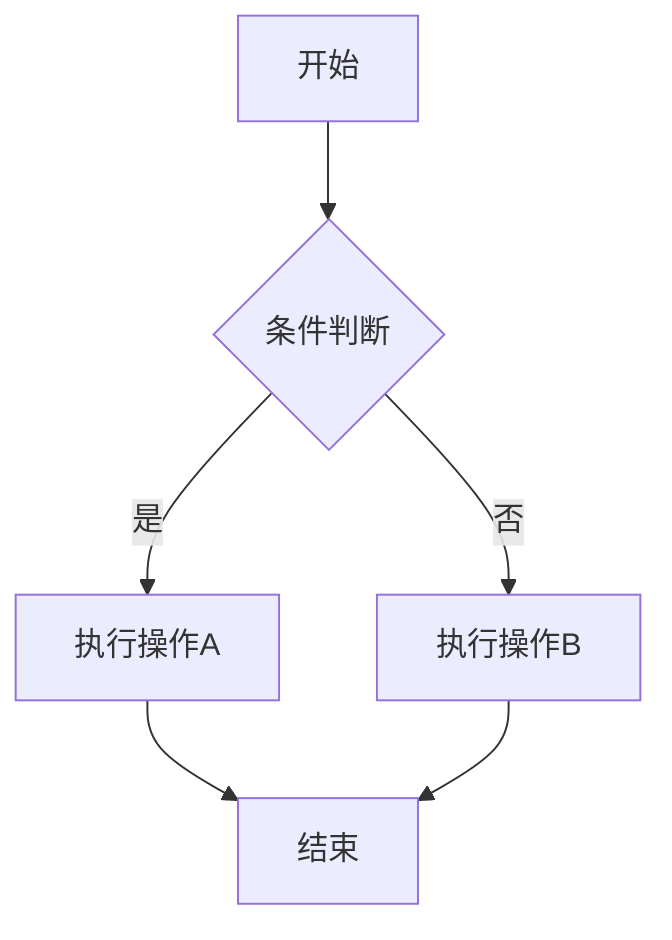
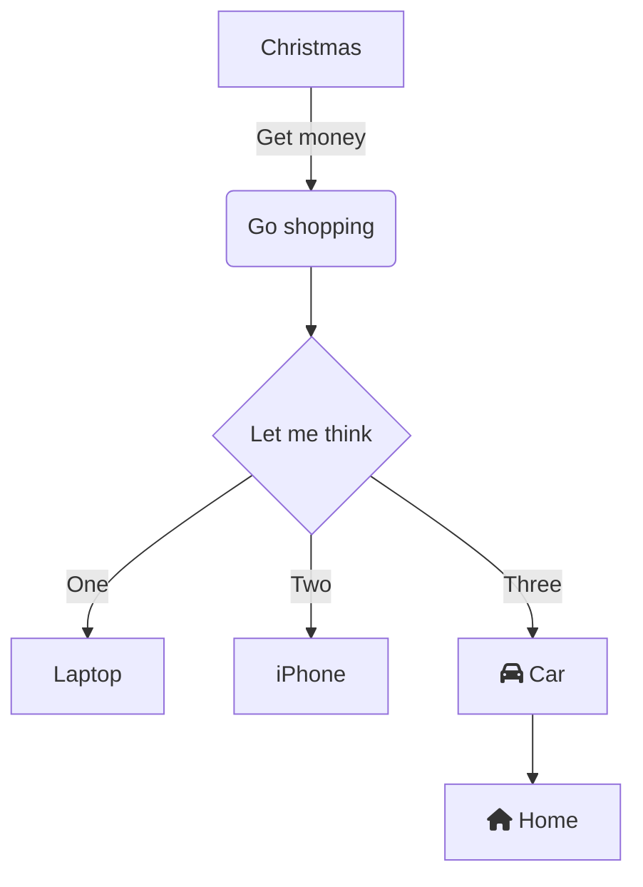
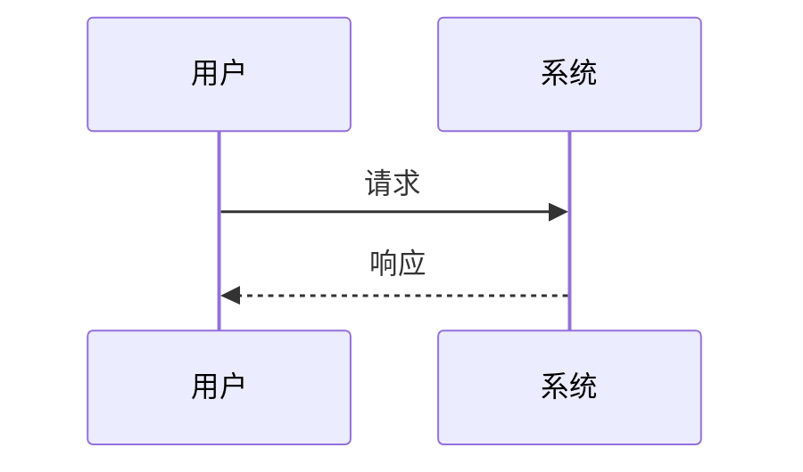

# Mermaid 错误处理测试

这个文件用于测试 Mermaid 图表的错误处理能力。

## 正常的流程图


## 包含 Font Awesome 图标的流程图（应该会被自动修复）


## 包含语法错误的图表（应该显示错误信息）
```mermaid
flowchart TD
    A[开始] --> B{
    B -->|是| C[操作A
    C --> D[结束
```

## 正常的时序图


如果以上图表能正确显示或显示友好的错误信息，说明错误处理工作正常。
